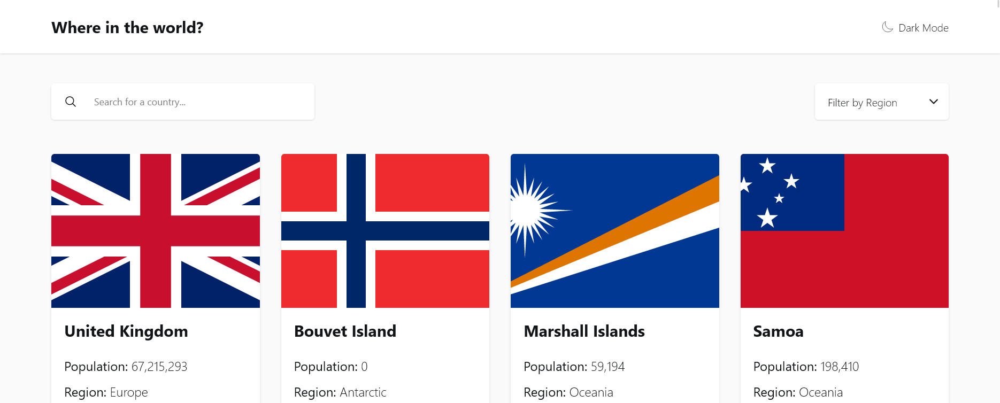
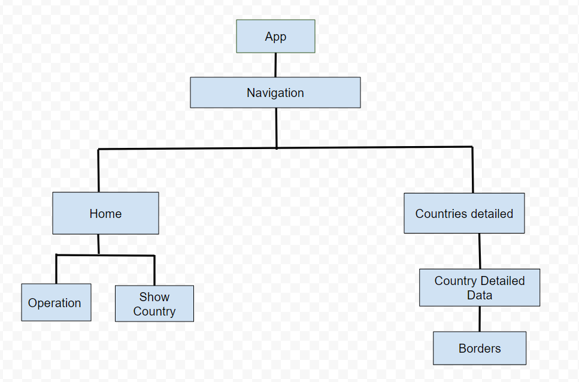
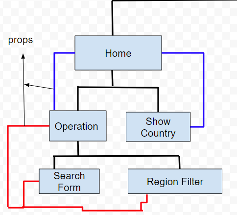
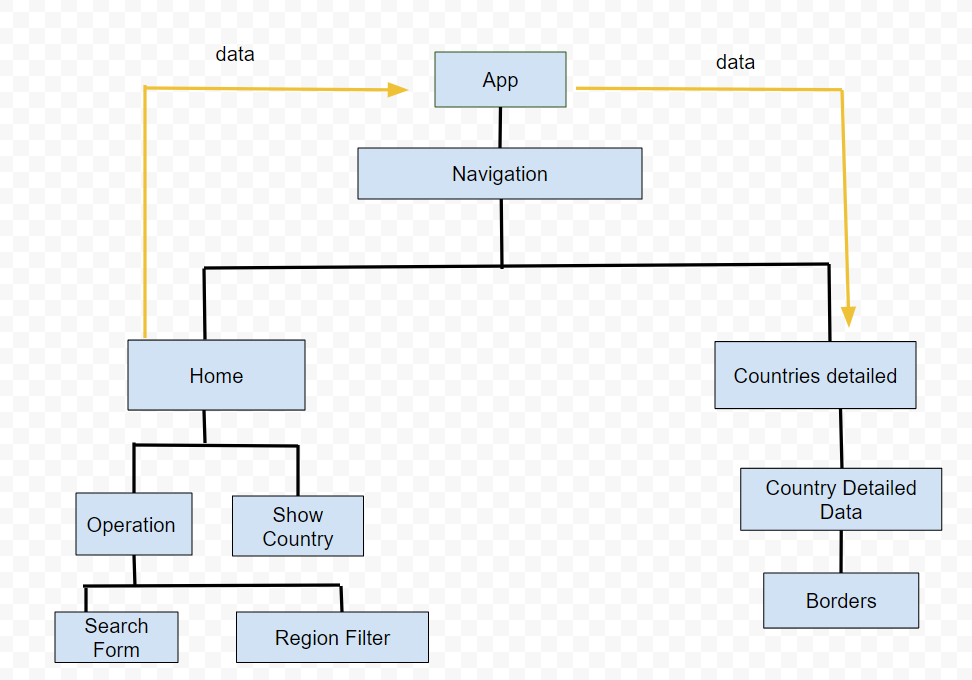
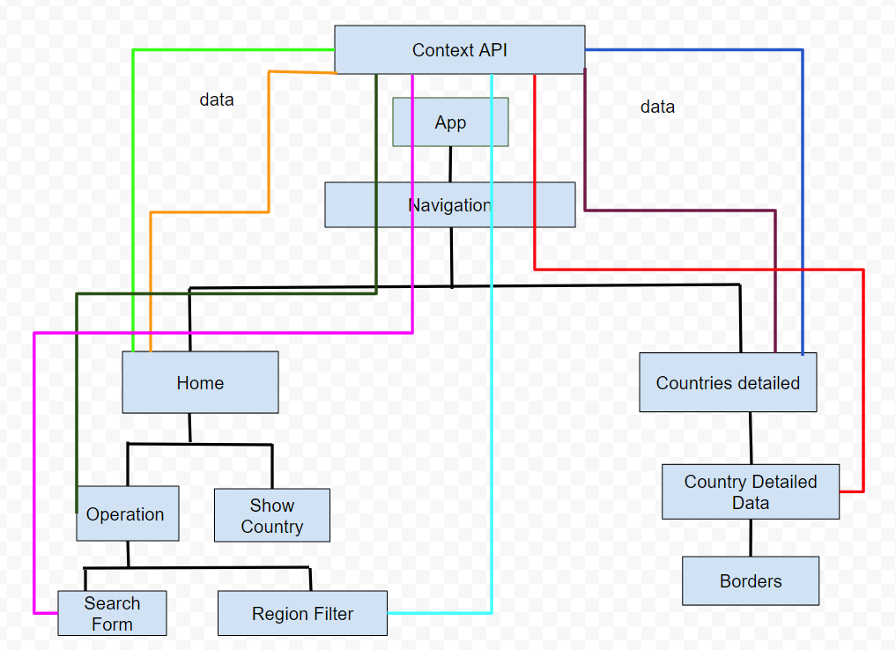

# Frontend Mentor - REST Countries API with color theme switcher solution

This is a solution to the [REST Countries API with color theme switcher challenge on Frontend Mentor](https://www.frontendmentor.io/challenges/rest-countries-api-with-color-theme-switcher-5cacc469fec04111f7b848ca). Frontend Mentor challenges help you improve your coding skills by building realistic projects. 

## Table of contents

- [Overview](#overview)
  - [The challenge](#the-challenge)
  - [Screenshot](#screenshot)
  - [Links](#links)
- [My process](#my-process)
  - [Built with](#built-with)
  - [What I learned](#what-i-learned)
  - [Useful resources](#useful-resources)
- [Author](#author)
- [Acknowledgments](#acknowledgments)

## Overview

### The challenge

Users should be able to:

- See all countries from the API on the homepage
- Search for a country using an `input` field
- Filter countries by region
- Click on a country to see more detailed information on a separate page
- Click through to the border countries on the detail page
- Toggle the color scheme between light and dark mode *(optional)*

### Screenshot



### Links

- Solution URL: [Code](https://github.com/tan911/rest-countries-app)
- Live Site URL: [Live site](https://tan911.github.io/rest-countries-app)

## My process

### Built with

- Semantic HTML5 markup
- CSS custom properties
- Flexbox
- CSS Grid
- Mobile-first workflow
- Scss/sass
- [React](https://reactjs.org/) - JS library
- [React Router](https://reactrouter.com/en/main) - For navigation
- [TailwindCSS](https://tailwindcss.com/) - CSS library
- [Vite](https://vitejs.dev/) - Build Tool


### What I learned

There is no such thing as ideal code to implement everything during development, so no matter what component I intended to isolate later on ends up with messy code. Fortunately, the complete application is functioning as I had anticipated.

Here is how my app is set up. I only added the parts that require props to send data in order to display the information.




- `Search form` - When a user attempts to search for a country's name
- `Region filter` - Whenever someone attempts to filter it by region, it

These components' value will be transferred to their parent,
In this scenario, the `Operation` component will get those values and pass them on to its parent component, the `Home` component.



Based on the values it will receive, `Home` component will filter these countries.

```js
    import { useEffect, useState } from 'react';

    export default function Home({value}) {
      const [ countries, setCountries ] = useState([]);
      const [ filterCountry, setFilterCountry] = useState('');

      useEffect(() => {
        // fetching data from REST api
        const data = async () => {
          const response = await fetch('rest-api');
          const data = await response.json();

          // updating the value of countries
          setCountries(data);
        };
      }, []);

      // updating the value of filterCountry
      // this will recieve a value of - country name or region name
      const item = (name) => {
        setFilterCountry(name);
      };

      // filtered countries base on 2 conditions
      // if one of them is true, simply return that country
      const filterCountries = countries.filter(cName => {
        return cName.name === filterCountry || cName.region === filterCountry;
      });

      return (
        <div>
          <Operation onItem={item} />
          <ShowCountry countryData={filterCountries}/>
        </div>
      )
    }
```

All the countries or the filtered countries will be displayed on the screen after the data from the `filterCountries` component is passed to the `ShowCountry` component.

There is nothing wrong with the excellent parent-child communication,
However, I am aware that if the user attempts to click any of these countries,
I must pass the information to the component for `Countries Detailed` in that country before distributing the data to `Country Detailed Data` and `Borders.`
Additionally, if a new component is added, data still needs to pass through all existing components before arriving at the final destination (the components that need those data).



As a result, sharing data between components is made simpler when I use the context API from React.
The "Context API" will receive direct communication from any component that requires such data, eliminating the requirement for travel between components.




### Useful resources

- [mdn docs](https://developer.mozilla.org/en-US/)
- [stackoverflow](https://stackoverflow.com/) 


## Author

- Frontend Mentor - [@tan911](https://www.frontendmentor.io/profile/tan911)


## Acknowledgments

Frontend community who assisted me in deploying these projects 🙏.